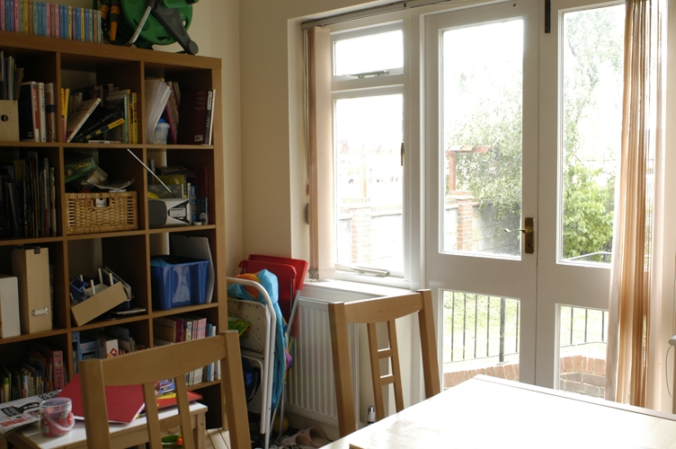

# Exposure Fusion

## Basic Informations  
Description: An algorithm that uses one image and enhance it by obtaining its different exposure and combining it into one image  
Language: Matlab  
Features:
- Only require 1 image to do exposure fusion
- The image doesn't necessarily need to have a good exposure level
- Have done comparison on the amount of different exposure needed to create a good image
- All output will be directly saved into `Results` folder with its timestamp on the file name

## Code Flow

## Example Inputs

Medium brightness input:  
  

Medium brightness input:  
  

Low brightness input:  
  

Very low brightness input:  
  

Very low brightness input:  

## Example Outputs

Medium brightness output:  
  

Medium brightness output:  
  

Low brightness output:  
  

Very low brightness output:  
  

Very low brightness output:  

